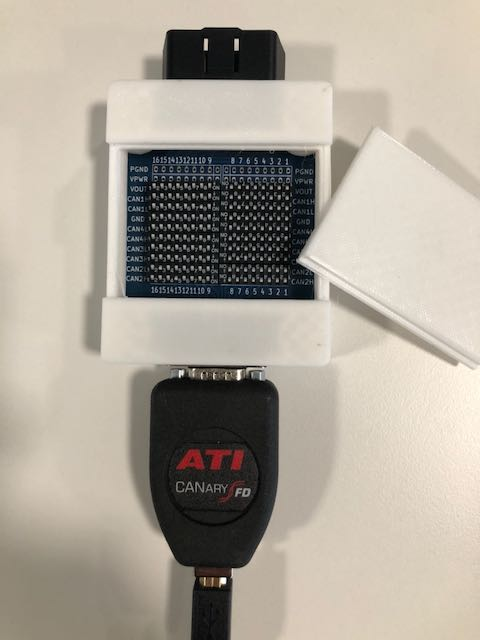

# CANary-Adaptor
Adaptor to connect an OBD2 port to an ATI CANary

The zip file contains all the files required to make the PCB, just drop it on to a PCB
manufacturing web site, choose the colour and pay the fee. 
Examples:

https://www.seeedstudio.com/fusion_pcb.html

https://cart.jlcpcb.com/quote

Both charge about $5 for 10 boards, and about twice that for shipping. 

You will also need a case, there are 3D printing files in the CASE folder. 
The case is held together by 4 off M3 x 5mm x 8mm heat-set inserts and 4 off M3 x 16
countersunk screws

Additional components:

OBD2 connector: https://www.aliexpress.com/item/1005001622470354.html
HD15 socket: Amphenol 10090926-P154VLF https://uk.rs-online.com/web/p/d-sub-connectors/7361510
SIP switch: APEM SIP-08TV https://uk.rs-online.com/web/p/dip-sip-switches/8772384

